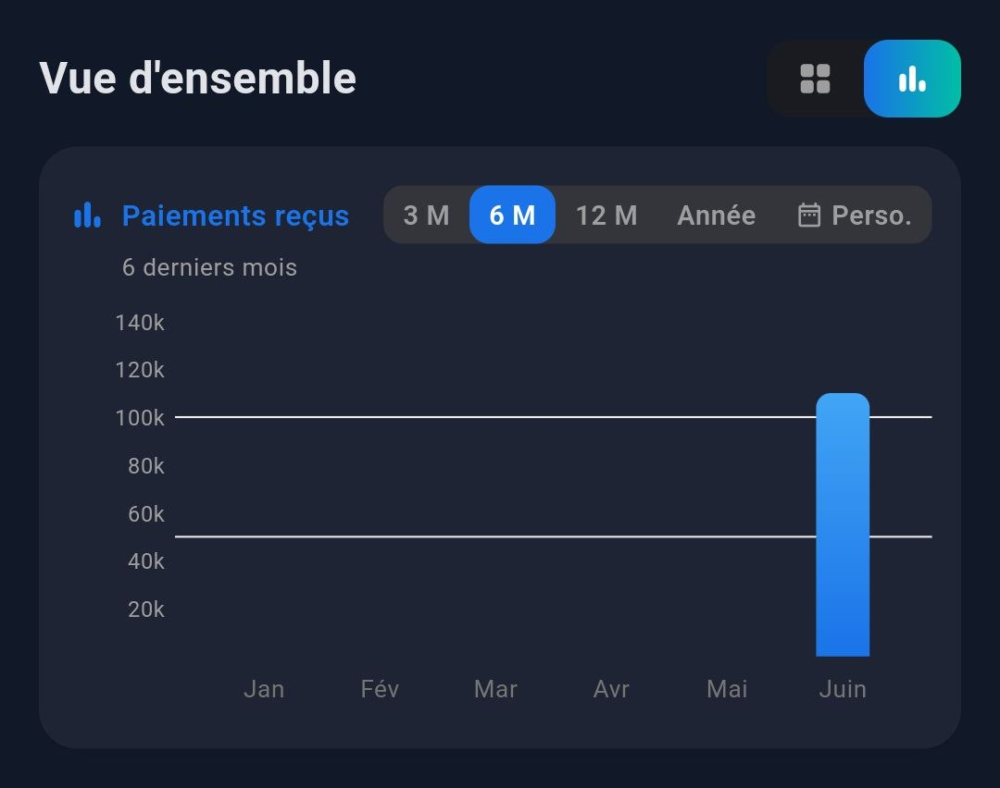
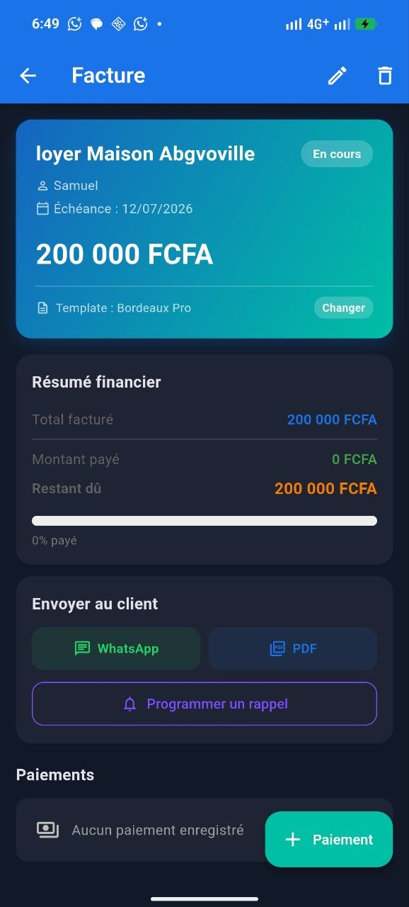
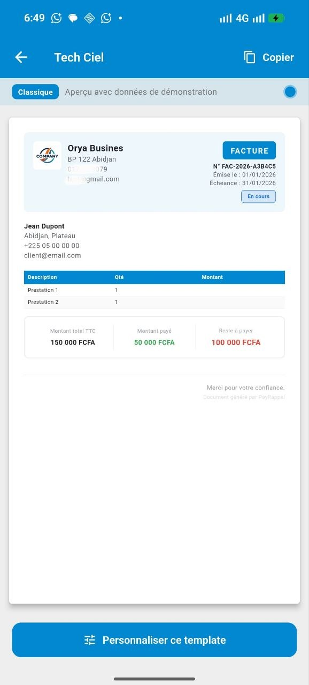
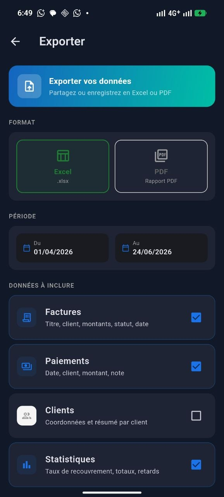

<div align="center">

# PayRappel

**Application mobile de gestion des paiements et de rappels automatiques**  
*Pour les entrepreneurs, freelances et petites entreprises d'Afrique francophone*

[](https://flutter.dev)
[](https://firebase.google.com)
[](https://flutter.dev)
[](LICENSE)

</div>

---

## Aperçu

<p align="center">
  
  
  
</p>

<p align="center">
  
  
  
</p>

---

## Présentation

PayRappel est une solution complète et **entièrement gratuite** pour gérer vos clients, créer des factures professionnelles, suivre les paiements partiels et envoyer des rappels automatiques aux clients en retard de paiement.

Conçue pour les entrepreneurs d'Afrique francophone, l'application fonctionne en **plusieures monnaies** et reste **100% fonctionnelle hors ligne**.

---

## Fonctionnalités

### Gestion des clients
- Créer, modifier et supprimer des fiches clients
- Importer les contacts directement depuis le téléphone
- Consulter l'historique complet de chaque client (factures, paiements)

### Facturation
- Créer des factures avec articles, quantités et montants
- Suivre le statut de chaque facture : `Brouillon` · `Partiel` · `Payé` · `En retard`
- Enregistrer des paiements partiels avec calcul automatique du solde restant

### Templates de factures
- 4 modèles de design : Classique, Moderne, Minimaliste, Audacieux
- Éditeur de sections personnalisable (ajouter, supprimer, réorganiser)
- Prévisualisation en temps réel

### Export
- Génération de **PDF** et **Excel**
- Partage direct depuis l'application (email, WhatsApp, etc.)

### Rappels automatiques
- Planifier des rappels avant, à la date ou après l'échéance
- Notifications push
- Rappels WhatsApp

### Profil entreprise
- Nom, logo, coordonnées, mentions légales
- Logo affiché sur les factures exportées

### Modes de paiement
- Configurer les moyens acceptés : Orange Money, Wave, MTN MoMo, Moov Money, Djamo, Stripe, PayPal, VISA, Mastercard

---

## Gratuit

PayRappel est **entièrement gratuit**. Toutes les fonctionnalités sont accessibles sans abonnement ni frais cachés.

---

## Stack technique

| Couche | Technologie |
|---|---|
| Framework | Flutter 3.x (Dart) |
| Authentification | Firebase Auth (email + mode invité anonyme) |
| Base de données | Cloud Firestore (offline-first) |
| Notifications | Firebase Cloud Messaging + flutter_local_notifications |
| Navigation | go_router |
| État | Provider / ChangeNotifier |
| Export PDF | package `pdf` + `printing` |
| Export Excel | package `excel` |
| Graphiques | fl_chart |
| Locale | Français (fr_FR), FCFA... |

---

## Architecture

```
lib/
├── core/           → Constantes, utilitaires, formatters
├── data/           → Firebase : modèles, repositories, services
├── domain/         → Règles métier (calcul solde, statut facture)
├── presentation/   → Écrans et widgets (un dossier par feature)
└── providers/      → State management (Provider)
```

**Modèle architectural :** Clean Architecture 3 couches + pattern MVVM via Provider.  
Les écrans appellent les repositories (couche `data/`) qui communiquent avec Firebase. Les règles métier (calcul du solde, statut des factures) vivent dans `domain/`, indépendantes de tout framework.

---

## Sécurité

- Règles Firestore déployées : chaque utilisateur accède uniquement à ses propres données
- Encryptage activé
- Mode invité : les utilisateurs anonymes ont un UID Firebase et peuvent convertir leur compte en compte email sans perte de données
- Persistance hors ligne : Firestore cache toutes les données localement (`cacheSizeBytes: CACHE_SIZE_UNLIMITED`)

---

## Prérequis

- Flutter SDK >= 3.5.4
- Compte Firebase (projet configuré avec FlutterFire CLI)
- Android SDK (minSdk 23 / Android 6.0+)
- Xcode (pour build iOS, macOS requis)

---

## Installation

```bash
# Cloner le dépôt
git clone https://github.com/MoayeGrace/payrappel.git
cd payrappel

# Installer les dépendances
flutter pub get

# Lancer en développement
flutter run
```

> Les fichiers `lib/firebase_options.dart`, `android/app/google-services.json` et `ios/Runner/GoogleService-Info.plist` sont exclus du dépôt. Configure ton propre projet Firebase via la [FlutterFire CLI](https://firebase.flutter.dev/docs/cli).

---

## Commandes utiles

```bash
# Analyser le code
flutter analyze

# Lancer les tests
flutter test

# Build Android (AAB pour Play Store)
flutter build appbundle --release

# Build Android (APK direct)
flutter build apk --split-per-abi --release

# Build iOS (requires macOS + Xcode)
flutter build ios --release
```

---

## Licence

Projet propriétaire — tous droits réservés.
